# Architecture

This document describes the architecture of the openclaw-vps-setup project.
The diagrams follow the C4 model levels: System Context → Containers → Components.

---

## Level 1 — System Context

Who uses the system and what external services does it depend on.

```mermaid
flowchart TB
    operator(["👤 Operator"])
    enduser(["👤 End User"])

    subgraph sys["OpenClaw VPS Setup"]
        infra["OpenClaw Infrastructure\nAnsible + Terraform IaC"]
    end

    onepassword[("1Password\nSecrets vault")]
    discord[("Discord API")]
    telegram[("Telegram API")]
    llm[("OpenAI / OpenRouter\nLLM inference")]
    tailscale[("Tailscale\nVPN mesh")]
    s3[("AWS S3\nBackups")]

    operator -->|"Ansible / Terraform"| infra
    enduser -->|"commands"| discord
    enduser -->|"commands"| telegram

    infra -->|"op inject"| onepassword
    infra -->|"Discord bot WebSocket"| discord
    infra -->|"Telegram Bot API"| telegram
    infra -->|"HTTPS REST"| llm
    infra -->|"WireGuard UDP 41641"| tailscale
    infra -->|"encrypted backup"| s3
```

---

## Level 2 — Containers

The major technical building blocks and how they relate.

---

## Level 3 — Components: Production VM

The internal components running on the production VM and how data flows between them.

---

## Level 3 — Components: Ansible Deployment Pipeline

How `ansible/site.yml` composes roles to build the production VM.

```mermaid
flowchart TB
    operator(["👤 Operator / CI Runner"])
    onepassword[("1Password")]
    vm_target[("Production VM\nor DevContainer")]

    subgraph playbook["ansible/site.yml"]
        pre_tasks["Pre-tasks\nload vault vars · fetch secrets\nwait for SSH · gather facts"]
        role_vendor["openclaw_vendor_base\nNode.js · Tailscale · UFW\nopenclaw user · pnpm · binary"]
        role_common["common\ntimezone · locale · packages"]
        role_op["onepassword\ninstall op CLI"]
        role_config["openclaw_config\nopenclaw.json · .env · op inject\nsystemd service · logrotate"]
        role_gateway["openclaw_gateway_proxy\nNginx · TLS cert · UFW rules\nif openclaw_lan_enabled"]
        role_samba["openclaw_samba\nSamba share · UFW rules\nif openclaw_samba_enabled"]
        post_tasks["Post-tasks\nverify binary · check service"]
    end

    operator -->|"make deploy"| pre_tasks
    pre_tasks -->|"op read"| onepassword
    pre_tasks --> role_vendor
    role_vendor --> role_common
    role_common --> role_op
    role_op --> role_config
    role_config --> role_gateway
    role_gateway -->|"if enabled"| role_samba
    role_samba --> post_tasks
    post_tasks -->|"result"| operator

    role_vendor -->|"configures"| vm_target
    role_common -->|"configures"| vm_target
    role_op -->|"installs on"| vm_target
    role_config -->|"configures"| vm_target
    role_gateway -->|"configures"| vm_target
    role_samba -->|"configures"| vm_target
```

---

## Secrets Architecture

The two-token model used to limit credential exposure on the VM.

**Key properties of the two-token model:**

| Token | Held by | Vault access | Used for |
|-------|---------|-------------|---------|
| Admin service account | Operator / CI | `OpenClaw` + `OpenClaw Admin` (read/write) | Deploy time: fetch all secrets, write runtime token to VM |
| Runtime service account | VM (`/etc/openclaw/ops_token`) | `OpenClaw` only (read) | `op inject` at deploy, daily backup cron |

The VM never holds admin credentials. If the VM is compromised, the blast radius is limited to the `OpenClaw` vault only.

---

## Testing Architecture

How changes are validated before reaching production.

